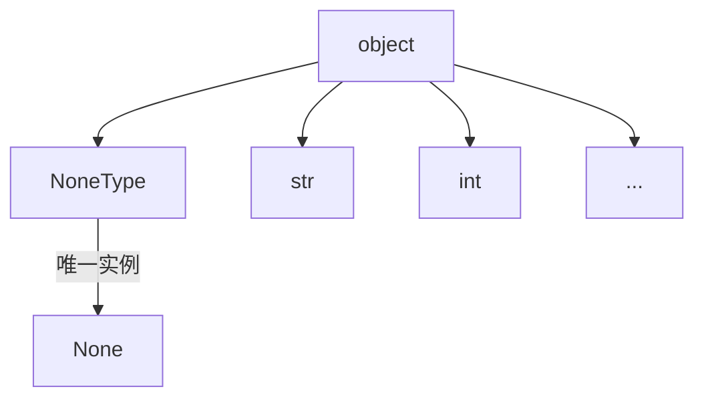

所谓空安全，也就是null safety，它是部分现代语言具有的新特性，如dart和kotlin，既然它是现代语言才具备的特性，说明之前的语言往往没有，例如java
<!--more-->
# java的空值不安全
众所周知，java只有原始类型和引用类型，而所有引用类型都是`Object`类的子类或`Object`类它自己，而java的空值不安全，也就出现在引用类型上。  
java的引用类型本质上就是指针，而作为深受C++影响的语言，它的引用类型也继承了C++的指针的问题——空指针问题  

在java中定义的任何一个类，都是`Obecjt`的子类，任何一个类的对象，都可以为空，也就是为`null`，也就是说，引用类型包含了`null`!

---  
所谓‘包含’，这又涉及一个概念，可以把一个类型看作一个集合，而这个类型的任何一个值看作这个集合中的一个元素，例如：
- `int`类型表示集合 $\Set{ x | x \in Z \land -2^{31} \le x \le 2^{31} - 1 } $ ，即所有`int`值的集合
- `float`类型表示的集合比较复杂，首先`float`是离散的，能表示的值范围有限而且精度有限，而且不是等间距的，还包括了IEEE定义的inf，-inf，以及NaN
- `Object`类型表示的集合更复杂，但可以任何是程序运行过程中可能创建的所有`Obejct`对象以及它的子类的对象

而null值可以作为任意引用类型的对象的值，这在数学上造成了一个漏洞，造成了以下问题
1. null值属于什么类型？  
   因为null可以作为任意引用类型的对象的值，所以null是任何引用类型的一个实例或它的子类的实例，但很明显这样的值是不能存在的
2. 在类中定义的方法和属性，在类的实例（对象）上不一定可用  
    java的`Object`对象有一个方法`toString()`，然而你不能在null上调用这种方法，否则会抛出异常，严格来说，在使用`toString()`前应该先判断这个对象是否为null
    
这样的漏洞都可以使用引用类型来解释，因为引用类型的所有值都代表对某个对象的引用，所以这个值可以为空，表示没有引用任何对象

# C++的空值安全？
C++的空值安全比较复杂，分为指针和引用两种类型  
指针很明显空值不安全，java的空值不安全本质上还是指针的空值不安全  
引用最大的优点就是，不存在空引用，也就是说，它缓解了C++的空指针问题，在合适的场合使用引用代替指针，可以减少空指针出现的情况
# python的空值安全
python相比java和JS，有一个很明显的特点：一切皆对象，也就是说，python中的所有值都是对象，也就是`object`类的实例，自然`None`也是`object`的实例  
然而，`None`是`NoneType`类的直接对象，也就是说，任何`NoneType`类以外的对象，都不可能为`None`，这么看来，python的空值设计比较合理  


但问题在于，python是动态类型语言，也就是说变量运行时类型可以随意改变，在使用type hint之前，python并不能从空值安全的设计中受益  
如果使用type hint，并引入严格的静态类型检查，python就是空值安全的。
- 假设你需要使用一个字符串变量，并且它可能为`None`，就应该写成
    ```python
    x : str | None = "...."
    ```
    如果你需要使用字符串的`strip`方法：
    ```python
    x.strip()
    ```
    这样的写法并不会通过诸如mypy这样的静态类型检查器，需要使用'type guard'保证`x`的类型为`str`而不是`str | None`
    ```python
    assert x is not None
    x.strip()
    # 或
    assert isinstance(x, str)
    x.strip()
    # 或
    if isinstance(x, str):
        x.strip()
    ```
- 假设你需要使用一个字符串，而且它不可能为空，应该写成
    ```python
    x : str = "...."
    ```
    尝试给它赋值`None`，可以运行但是无法通过静态类型检查
    ```python
    x : str = None  # mypy报错

    # 或
    x : str = "...."
    x = None    # mypy报错
    ```
# dart的类型安全
dart3.0引入了一个新特性：空值安全  
dart也是一切皆对象，而dart只有两类类型，一个是`Null`类，一个是`Object`类。从语言的底层设计就能看出dart对空值的态度  

- 如果一个变量不能为空
```dart
String x = "...."
// 不能为空的变量必须在声明时赋初值，如果是类的属性，则必须在构造函数中赋值
```
- 如果可能为空
```dart
String? x;
// 可空的变量，默认初值为null
```
`String?`不是任何传统的类型，而是两种类型的组合，类似python的`str | None`，如果使用前文提及的集合的观点，这种类型属于`String`类型和`Null`类型的集合并集，只不过dart并没有提供使用`class`关键字定义这个类的语法能力  

此外dart是静态类型的语言，还拥有强大的类型推断能力(type inference)，又提供了null相关的语法糖，能够避免写下很多琐碎的类型断言（例如python的`assert x is not None`）
`null`相关语法糖使用了 `!`和`?`，并和dart其他特性配合，组合出非常多的使用方式，例如在级联操作符中使用，在pattern中使用等等，例如
- null-aware
    ```dart
    String? notAString = null;
    print(notAString?.length);
    ```
    如果`notAString`为`null`，不报错，表达式返回`null`
- null-aware短路
    ```dart
    showGizmo(Thing? thing) {
        print(thing?.doohickey.gizmo);
    }
    ```
    如果`thing`为`null`，不会评估表达式后面的部分，直接返回，避免写下`thing?.doohickey?.gizmo`这样繁琐的表达式
- null-aware与下标运算符
  ```dart
  receiver?[index];
  ```
- null-aware与[级联运算符](https://dart.dev/language/operators#cascade-notation)
    ```dart
    receiver?..method();
    ```
- null assert
    ```dart
    String toString() {
        if (code == 200) return 'OK';
        return 'ERROR $code ${error!.toUpperCase()}';
    }
    ```
    一旦error的运行时类型为`null`，就会出现转型错误（cast error），抛出运行时异常
- 与[pattern](https://dart.dev/language/patterns)配合
    ```dart
    String? maybeString = 'nullable with base type String';
        switch (maybeString) {
        case var s?:
        // 's' has type non-nullable String here.
    }
    ```
    ```dart
    List<String?> row = ['user', null];
        switch (row) {
        case ['user', var name!]: // ...
        // 'name' is a non-nullable string here.
    }

    ```
    ```dart
    (int?, int?) position = (2, 3);

    var (x!, y!) = position;
    ```
dart的null safety有一个特点：一个变量，只要编译器确定了它不为空，那么它永远不可能为`null`，这种特性被称为sound null safety