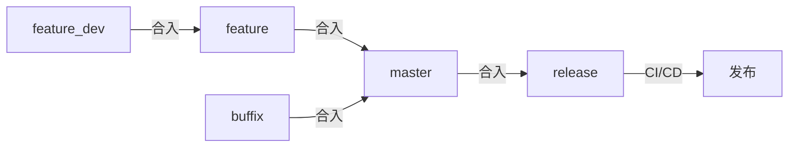

git相关文章在各种技术论坛、博客都能找到不少，可以说讲git已经是烂大街的文章了，这篇文章虽然跟git有关，但我希望避开各种无聊而且每篇文章都在谈论的话题，输出一些我从各种角落中积累的知识
> **Note:** 如果想学习git，可以看[《pro git》](https://git-scm.com/book/en/v2)

## CI/CD
一个大型软件往往都有CI/CD系统，以我在实习中即将参与开发的一个产品来说，该产品（以下简称app）有以下需求
- 定期发布新版本
- 每次发布需要在多个平台同步发布，具体而言：
    - Windows, Android, iOS, MacOS，iPad, Android平板，Linux等平台
    - 在官网、Android各厂商的应用商店，app store，各种电脑管家提供的软件下载中心等平台发布
- 需求完成后需要交给测试同学完成测试，测试同学需要在相应平台安装app进行测试，此时的app是不对外公布的测试版本，在内部某个git分支上构建产生

以上需求需要长期、频繁地构建app，CI/CD系统完成的就是这种重复工作

## semver
Semantic Versioning，即语义化版本，是软件包的一个约定，[semver.org](https://semver.org/)如是说
>Given a version number MAJOR.MINOR.PATCH, increment the:
>1. MAJOR version when you make incompatible API changes
>2. MINOR version when you add functionality in a backward compatible manner
>3. PATCH version when you make backward compatible bug fixes
即：
1. 版本号主要由`主版本号.次版本号.修订号`组成
2. 同一个主版本号内保证不出现不兼容的改动
3. 增加与前版本兼容的功能只需要增加次版本号
4. 紧急bug，安全漏洞的修复可以通过增加修订号快速发布

semver面对的背景如下
1. 软件包存在依赖关系
2. 软件包需要持续迭代，不断增加功能并修复bug
3. 上层软件希望它依赖的软件包是稳定的，不出现dependency break
4. 下层软件希望上层软件包不断更新其依赖，使最新的特性被使用，并结束旧版本的支持

它解决了以下问题
1. 下层软件可以不断迭代而不必担心其更新导致现有项目无法运行
2. 历史遗留系统在部署时不出现dependency break
3. 安全漏洞的修复可以最快地应用于生产环境的项目

semver在许多软件包发布系统中都有应用，例如linux众多发行版的软件源，pypi，npm等；当然也有很多不遵守的例子
1. linux内核
2. chromium
3. PotoShop
4. Visual studio
5. matlab

不遵守semver的最直接的原因是，这些软件包并不存在直接的被依赖关系  

## semver的应用
一个合格的包管理器往往集成了semver，npm和python都提供了版本标记语法，例如
- `~5.0.0`表示安装5.0.0并接受补丁
- `^5.0.0`表示安装5.0.0并接受兼容的功能更新

此外，也有特殊情况不遵守semver，一个合格的包管理器还应当具有锁版本的功能，即同一份配置文件在重新安装依赖时，一定产出一样的依赖以及依赖的依赖，保证依赖不发生任何变动

以cmake的`ExternalProject`为例，它提供了丰富的功能以完全控制一个第三方依赖  
1. 下载软件包  
   支持http下载、git下载、subversion下载、自定义命令下载
2. configure
   可以在此阶段传入编译参数控制软件包的行为
3. build
   可以自定义编译命令，完全控制构建过程和输出的产物
4. install
   可以自定义安装命令，控制安装的位置

其中使用下载软件包支持下载指定分支、指定标签、指定hash，可以轻松控制软件包的版本。如果使用http下载，通常填入官网提供的release版下载链接，版本号通常在会出现在url中，也能控制软件包的版本

## semver与CI/CD与git
前文提及CI/CD一般是在某个分支上（一般是main或master或release）构建出软件包，开发者只需要提交或合并，使分支发生更新，就能触发CI/CD  
git的每次提交都会产生hash，一般来说hash是整个仓库唯一的，在某次提交中构建出的软件包，可以以hash作为版本号的一部分  
git还能给某次提交打上标签，针对这次提交构建出的软件包，可以将标签名作版本号的一部分。更进一步，实际上可以将版本号作为标签名，当分支上出现新的标签时，会触发CI/CD，并触发后续的发布流程

以上提及的流程是软件开发者只维护最新版本的情况，实际上，同时维护多个版本的情况是非常常见的，尤其是软件包已经作为依赖进入了生产环境  

假设python2还没有停止支持，python开发者同时维护python2.x和python3.x，python2.x虽然不会出现功能更新，但仍然接受安全修复。更进一步，假设现在python3.12已经发布，而正在开发的是python3.13，此时python3.12发现一个漏洞需要立刻修复，此时使用一个分支作为CI/CD构建的分支是不够的。常见的做法是，python2.x使用`release/2.x`作为分支名，而python3.x使用`release/3.x`作为分支名，而`release/`目录下的所有分支都能触发CI/CD

## git workflow
app的开发部门有上百名开发者，git仓库每时每刻都有可能发生推送，为了实现百名开发者的协作，app采用了以下流程
- release分支作为发布使用，在任何时刻release分支构建出来的软件包都是可以对外公布的包。release分支不接受推送，只接受master分支的合入
- master分支拉出其他所有分支，不接受推送，只接受feature系列分支和bugfix分支的合入，
- feature系列分支具有实现需求的代码，不接受推送，只接受feature_dev系列分支合入。一次版本更新包括多个需求，会产生对应的feature分支
- feature_dev系列分支是开发者个人使用的分支。一个需求一般对应一个feature分支，而一个需求往往由几个开发者合作完成，每个开发者分别在自己的feature_dev分支上开发
- bugfix系列分支具有修复某个bug或某个安全漏洞的代码，完成修复后合入master

可以看出合并的顺序，或者从开发者敲下一行代码，到最终进入产品的过程如下

使用这样一个流程，原因如下
1. app是一个2C的产品，只维护最新版本
2. 大部分冲突在feature_dev合入feature时解决（一般冲突范围小，而且与同一个需求相关，容易解决），其次由feature合入master分支时解决
3. 线上出现问题时，修复代码可以通过bugfix分支快速进入产品中

合入的过程无法在本地完成，必须在git平台完成，合入需要对应分支的负责人完成codereview并批准

此外，feature_dev合入feature时，由对应的开发者完成本地自测，feature合入master时，由CI/CD系统构建出测试用的app，并交由测试同学完成测试。所有feature分支合入master分支后，需要运行一个完整的全面的测试，视bug数量和影响程度决定是否进入后续的发布流程

## 常见概念
- nightly build  
  常见于大公司的大型开源项目中，大公司有许多开发者负责项目的开发，每天推送代码后，开发者下班回家，此时基本不会发生推送，CI/CD系统开始运行，从当天最新代码中构建出最新的软件包，得名于一般在每天晚上构建

  nightly build因为频繁更新，稳定性欠佳，但因为具有最新的特性，某些情况下可以使用nightly build的软件包以快速得到修复或体验新特性
- 灰度  
  新版本的软件包在部分用户完成灰度测试，收集日志和灰度用户的反馈，判断软件包的质量，以决定是否全量发布。如果将产品上线认为是黑，未上线是白，那么仅推送给部分用户就是灰度

  灰度用户的比例往往较小，而且灰度用户无感知，因为灰度软件包往往是静默完成的更新
- 构建号  
  因为CI/CD重复、频繁的构建，需要一种id来确定软件包来源于哪次构建  
  CI/CD系统往往需要填写一些secrets，例如访问token，数据库密码等，使用不同的secrets，就能将软件包部署到不同的环境。此外还能填写国家代号、区域代号，实现一份代码构建出不同的软件包给不同国家或区域的用户使用。

  >因为不同国家的法律要求不同，软件包往往会在某些国家屏蔽部分功能以合规。以app为例，有专门的法务部研究市场所在国家的法律，并将消息同步给开发部门。法务部门不仅仅需要研究哪些功能是不合规的，还需要判断哪些行为具有合规风险

  以上原因导致无法通过构建基于的提交的hash来唯一确定软件包来源于哪次构建，所以使用构建号来区分
  
  以windows系统为例，系统版本号中就带有构建号
  | Version | Servicing option             | Availability date | Latest revision date | Latest build |
  | ------- | ---------------------------- | ----------------- | -------------------- | ------------ |
  | 22H2    | General Availability Channel | 2022-10-18        | 2024-07-09           | 19045.4651   |
  | 21H2    | General Availability Channel | 2021-11-16        | 2024-07-09           | 19044.4651   |
---
未完待续。。。